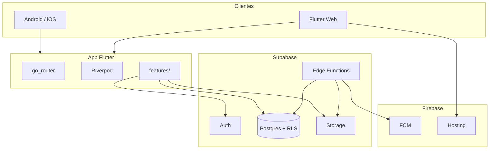
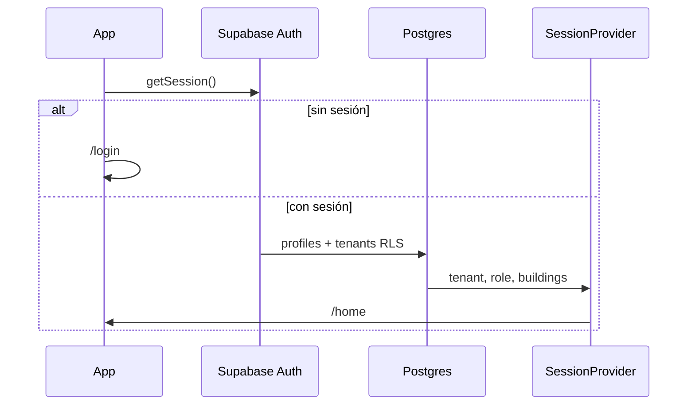

# Arquitectura — Comunexa

Stack: [`technical-brief.md`](technical-brief.md).

## 1. Contexto

| Aspecto | Valor |
|---|---|
| Producto | SaaS white-label PH multi-tenant |
| Canales | Google Play · App Store · Web (Firebase Hosting) |
| Backend | Supabase (Postgres + RLS + Auth + Storage + Edge Functions) |
| Push | FCM |
| CI/CD | GitHub Actions |
| Pagos | Pausados (esquema listo) |
| Piloto | Administradores Diaz PH SAS |

## 2. Vista del sistema

**Multi-tenant:** un proyecto Supabase; aislamiento por RLS + `tenant_id`.

## 3. Marca dinámica

Un build Flutter para todas las administradoras. Config desde `tenants` al login. Flavors white-label = futuro enterprise.

## 4. Flujo de arranque

## 5. Datos

Ver [`database/er-diagram.md`](database/er-diagram.md). Incluye `invoices`/`payments` aunque el cobro in-app esté pausado.

## 6. Seguridad

RLS: [`database/rls-policies.md`](database/rls-policies.md). Resumen: [`security.md`](security.md).

## 7. Integraciones

| Integración | v1 |
|---|---|
| FCM | Sí — Edge `send-push` |
| PDF visitas | Sí — Edge `generate-visit-pdf` |
| Cuotas mensuales | Sí — crear `invoices` (sin cobro) |
| Wompi/PayU | No — stub `payment-webhook` |

## 8. Flutter

[`flutter-structure.md`](flutter-structure.md) — features con data/domain/presentation.

## 9. Entornos y CI

**Ahora:** un solo proyecto Supabase + un solo Firebase (FCM + Hosting). Sin staging/prod.

**Después (piloto con datos reales / clientes):**

| Entorno | Supabase | Firebase |
|---|---|---|
| development | `comunexa` (actual) | `comunexa` (actual) |
| production | `comunexa-prod` (futuro) | `comunexa-prod` (futuro) |

CI: [`ci-cd.md`](ci-cd.md) — web en `main`; móvil gated por variables.

## 10. vs prototipo Diaz PH

| Prototipo | Comunexa |
|---|---|
| Firestore | Postgres + RLS |
| Monotenant | Multi-tenant |
| Hosting genérico | Firebase Hosting |
| Pagos varios | Pausados en v1 |
