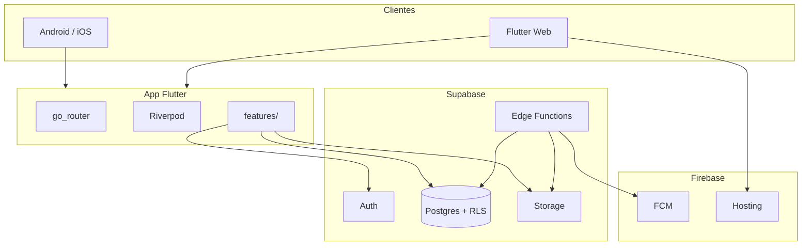
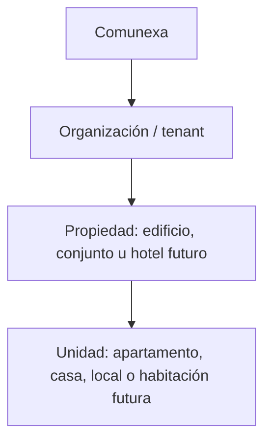
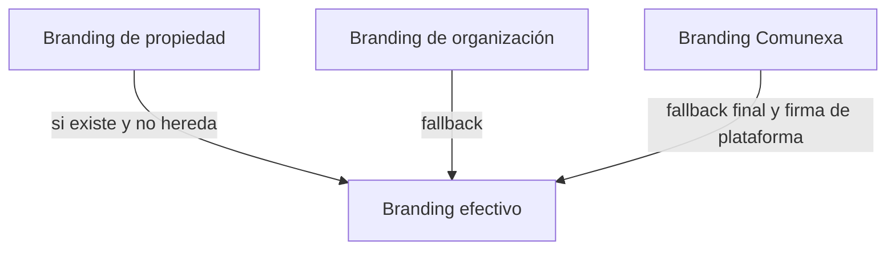
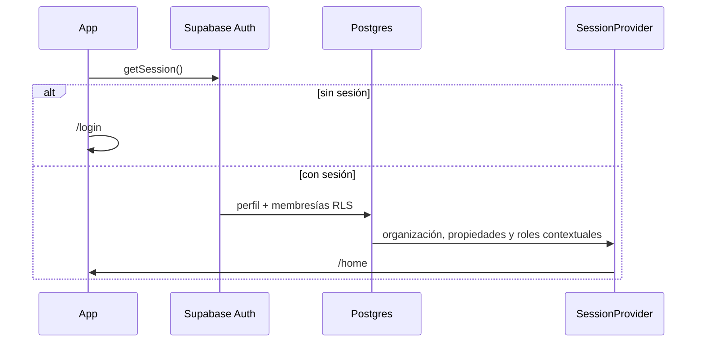

# Arquitectura — Comunexa

Stack: [`technical-brief.md`](technical-brief.md).

## 1. Contexto

| Aspecto | Valor |
|---|---|
| Producto | SaaS white-label multi-tenant y multi-propiedad; PH primero |
| Canales | Google Play · App Store · Web (Firebase Hosting) |
| Backend | Supabase (Postgres + RLS + Auth + Storage + Edge Functions) |
| Push | FCM |
| CI/CD | GitHub Actions |
| Pagos | Pausados (esquema listo) |
| Piloto | Administradores Diaz PH SAS |

## 2. Vista del sistema

**Multi-tenant:** un proyecto Supabase; aislamiento por RLS + `tenant_id`. Cada organización contiene propiedades. `tenant`/`building` son los nombres físicos actuales; el lenguaje objetivo de dominio es `organization`/`property`.

## 3. Jerarquía de dominio y acceso

- `platform_superadmin`: privilegio global de Comunexa.
- `organization_admin`: administración de toda una organización.
- `property_manager`: control completo de propiedades asignadas.
- `property_staff`: operación limitada por permisos en propiedades asignadas.
- `member`: cliente vinculado a unidades u ocupaciones.

Los roles de organización y propiedad son **membresías contextuales**. No se modelan como un solo rol permanente en `profiles`: una persona puede administrar una propiedad, operar otra y ser miembro de una tercera.

**Transición:** migración **003** añade organizations/properties/memberships/occupancies/permisos. El SQL 001/002 (`profiles.role`, `buildings`, `building_admins`, `resident_units`) sigue en paralelo hasta cutover + policies de dominio. Ver [`docs/database/access-model.md`](database/access-model.md).

## 4. Marca dinámica

Un build Flutter para todas las organizaciones y propiedades. La aplicación resuelve una identidad efectiva al seleccionar la propiedad activa:

| Modo | Resultado | Disponibilidad |
|---|---|---|
| `inherit` | Organización + firma Comunexa | MVP |
| `co_branded` | Propiedad principal + organización + firma Comunexa | MVP recomendado |
| `white_label` | Propiedad u organización sin firma visible de Comunexa | Enterprise futuro |

Configuración prevista por propiedad: `display_name`, `logo_url`, `primary_color`, `secondary_color`, imagen de portada, contacto y `branding_mode`. Los valores ausentes heredan de la organización y luego de Comunexa.

El `SessionProvider` carga organización, propiedad activa y branding efectivo. Al cambiar de propiedad, actualiza la identidad sin cerrar sesión. La misma resolución se reutiliza en UI, correos, PDFs y notificaciones compatibles.

Solo `organization_admin` y `property_manager` pueden modificar el branding de una propiedad; `property_staff` y `member` tienen lectura. Colores e imágenes se validan por contraste, formato, dimensiones y tamaño. Flavors con nombre o icono distinto en tiendas siguen siendo enterprise futuro.

### Nombre e icono instalados

- **iOS/Android, app Comunexa compartida:** nombre e icono instalados pertenecen al paquete publicado y permanecen como Comunexa. La identidad de organización/propiedad se muestra dentro de la app.
- **PWA/web instalable:** un deployment o manifest por dominio de cliente puede definir nombre, iconos y colores propios. Requiere estrategia de hosting, caché, dominios y mantenimiento por cliente.
- **White label nativo enterprise:** build, bundle/application ID, firma, ficha de tienda, iconos y nombre propios. Es una variante distribuible independiente, con costo operativo y de release adicional.

Los iconos alternativos preincluidos por plataforma no sustituyen el white label dinámico: son un conjunto finito empaquetado en el build y el nombre instalado continúa ligado a la configuración de la app. No se descargará un logo arbitrario para convertirlo en icono nativo.

## 5. Flujo de arranque

## 6. Datos

Ver [`database/er-diagram.md`](database/er-diagram.md). Incluye `invoices`/`payments` aunque el cobro in-app esté pausado.

La suscripción comercial es un agregado separado de `invoices`/`payments` de residentes. Un `billing_account` pagado por organización o propiedad puede cubrir una o varias propiedades. Plan y entitlements gobiernan capacidades; membresías y ocupaciones gobiernan acceso a datos. Invitaciones privadas y solicitudes de ingreso producen membresías solamente después de validación. Ver [`subscriptions-and-onboarding.md`](subscriptions-and-onboarding.md).

## 7. Seguridad

RLS: [`database/rls-policies.md`](database/rls-policies.md). Resumen: [`security.md`](security.md).

## 8. Integraciones

| Integración | v1 |
|---|---|
| FCM | Sí — Edge `send-push` |
| PDF visitas | Sí — Edge `generate-visit-pdf` |
| Cuotas mensuales | Sí — crear `invoices` (sin cobro) |
| Wompi/PayU | No — stub `payment-webhook` |

## 9. Flutter

[`flutter-structure.md`](flutter-structure.md) — features con data/domain/presentation.

**Estado app (2026-08-25):** bootstrap + **`supabase_flutter`** + Auth email/password (`AuthRepository` / SessionNotifier) + tema + splash + login + home shell mock. OAuth Google/Apple y `go_router` pendientes. Detalle en el roadmap Fase 2.

## 10. Entornos y CI

**Ahora:** un solo proyecto Supabase + un solo Firebase (FCM + Hosting). Sin staging/prod.

**Después (piloto con datos reales / clientes):**

| Entorno | Supabase | Firebase |
|---|---|---|
| development | `comunexa` (actual) | `comunexa` (actual) |
| production | `comunexa-prod` (futuro) | `comunexa-prod` (futuro) |

CI: [`ci-cd.md`](ci-cd.md) — web en `main`; móvil gated por variables.

## 11. Extensión hotelera

La arquitectura permite incorporar hoteles mediante `property_type = hotel`, tipos de unidad como `hotel_room` y ocupaciones con vigencia (`starts_at` / `ends_at`). No se implementará lógica hotelera en el MVP PH; cualquier migración debe conservar el aislamiento por organización y propiedad.

## 12. vs prototipo Diaz PH

| Prototipo | Comunexa |
|---|---|
| Firestore | Postgres + RLS |
| Monotenant | Multi-tenant |
| Hosting genérico | Firebase Hosting |
| Pagos varios | Pausados en v1 |
