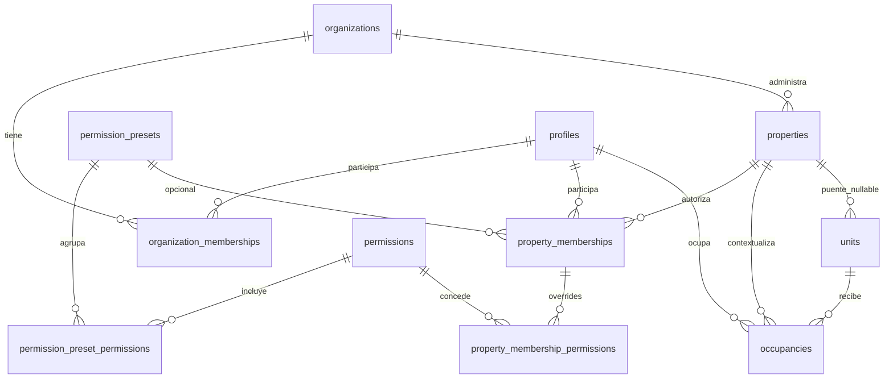
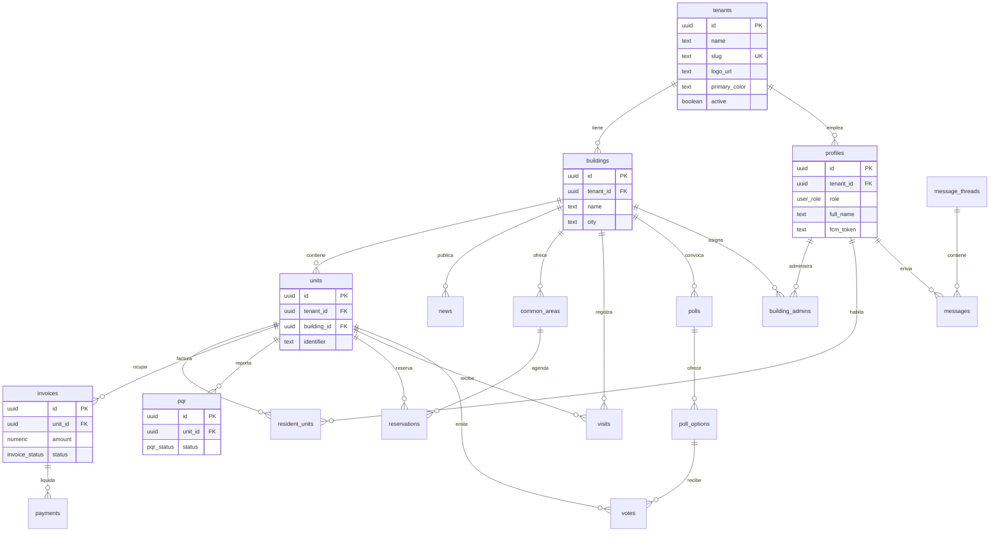

# Diagrama entidad-relación — Comunexa

Esquema Postgres en Supabase.

> **Estado:** migraciones **001/002** = dominio legacy (`tenants`/`buildings`). Migración **003** = modelo objetivo de identidad/acceso (`organizations`/`properties`/memberships). Detalle: [`access-model.md`](access-model.md). No editar migraciones ya aplicadas.

## Modelo objetivo de identidad y acceso (003)

- `profiles.is_platform_superadmin` es el privilegio global; `profiles.role` es legacy.
- `organization_memberships.role`: `organization_admin` o `member`.
- `property_memberships.role`: `property_manager`, `property_staff` o `member`.
- `property_staff` usa `permission_preset_id` (p. ej. `security_guard`) y/o overrides.
- `properties.property_type`: `building` / `residential_complex`; `hotel` reservado.
- `occupancies`: tipo + vigencia + estado; historial al cerrar.

Legacy vigente en paralelo hasta cutover: `tenants`, `buildings`, `building_admins`, `resident_units`.

Pendiente de migraciones futuras (no en 003):

- `billing_accounts` / suscripción;
- `property_join_codes`, `property_invitations`, `membership_requests`;
- `visitors`, `vehicles`, `visit_authorizations`, `access_events`.

Detalle: [`../subscriptions-and-onboarding.md`](../subscriptions-and-onboarding.md) · [`../access-control-and-media.md`](../access-control-and-media.md) · [`access-model.md`](access-model.md).

## Diagrama principal (legacy 001/002)

## Agrupación por dominio

| Dominio | Tablas |
|---|---|
| Plataforma / tenant | `tenants` |
| Estructura física | `buildings`, `units` |
| Usuarios y acceso | `profiles`, `building_admins`, `resident_units` |
| Finanzas | `invoices`, `payments` |
| Operación | `news`, `common_areas`, `reservations`, `visits`, `pqr` |
| Comunicación | `message_threads`, `messages`, `notifications_log` |
| Gobernanza | `polls`, `poll_options`, `votes` |

## Reglas de diseño

1. **`tenant_id` redundante** en tablas hijas de `buildings` / `units` para simplificar políticas RLS sin JOINs profundos en cada policy.
2. **`profiles.id`** = `auth.users.id` (Supabase Auth).
3. **Un voto por unidad por encuesta** — constraint `unique (poll_id, unit_id)` en `votes`.
4. **Identificador de unidad** único por edificio — `unique (building_id, identifier)`.

## Archivos SQL

- Esquema legacy: [`../../supabase/migrations/001_initial_schema.sql`](../../supabase/migrations/001_initial_schema.sql)
- RLS legacy: [`../../supabase/migrations/002_rls_policies.sql`](../../supabase/migrations/002_rls_policies.sql)
- Acceso objetivo: [`../../supabase/migrations/003_access_model.sql`](../../supabase/migrations/003_access_model.sql)
- Resumen acceso: [`access-model.md`](access-model.md)
- Copia de referencia legacy: [`schema.sql`](schema.sql)

## Storage (Supabase, no ER)

Buckets previstos:

| Bucket | Ruta ejemplo | Contenido |
|---|---|---|
| `tenant-assets` | `{tenant_id}/logo.png` | Logos de marca |
| `property-assets` (objetivo) | `{tenant_id}/{property_id}/branding/{asset}` | Logo y portada de la propiedad; crear con la migración de propiedades |
| `building-docs` | `{tenant_id}/{building_id}/visits/{id}.pdf` | PDFs de visitas |
| `pqr-attachments` | `{tenant_id}/{pqr_id}/...` | Adjuntos PQR |

Políticas de Storage en [`../security.md`](../security.md).
