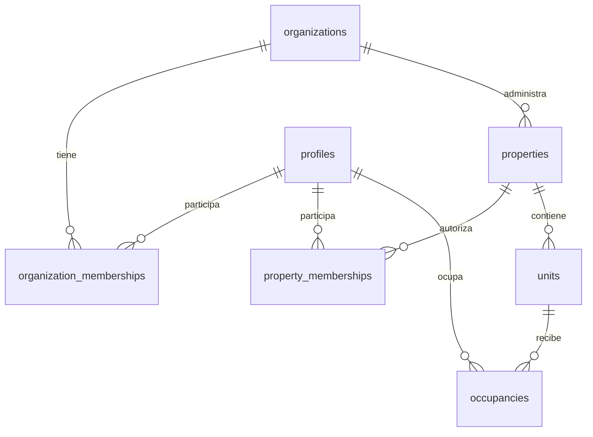
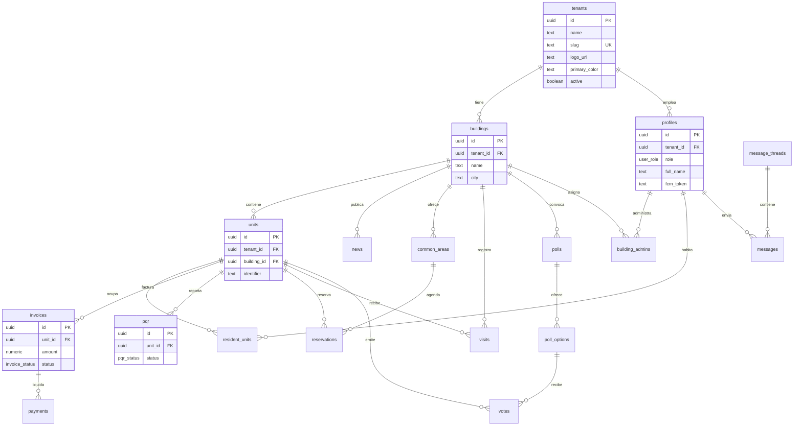

# Diagrama entidad-relación — Comunexa

Esquema Postgres en Supabase. Todas las tablas de negocio incluyen `tenant_id` para RLS.

> **Estado:** el diagrama principal refleja las migraciones 001/002 actuales. Antes de Auth real se debe crear una migración nueva hacia el modelo objetivo de membresías descrito abajo; no se deben editar migraciones ya aplicadas.

## Modelo objetivo de identidad y acceso

- `profiles` no contiene un único rol operativo.
- `organization_memberships.role`: `organization_admin` o `member`.
- `property_memberships.role`: `property_manager`, `property_staff` o `member`; los permisos operativos se limitan por RLS.
- `platform_superadmin` es un privilegio global separado.
- `properties.property_type`: inicialmente `building` / `residential_complex`; `hotel` queda reservado para evolución futura.
- `occupancies` generaliza la relación con una unidad mediante tipo y vigencia. En PH cubre propietario/arrendatario; en una extensión futura podría cubrir huéspedes.

Los nombres físicos definitivos y la estrategia de migración se cerrarán en la siguiente migración. Hasta entonces, `tenants`, `buildings`, `building_admins` y `resident_units` siguen siendo la fuente SQL vigente.

El modelo objetivo también incorpora, sin reutilizar facturas de residentes:

- `billing_accounts`, suscripción + plan/entitlements y relación a una o varias propiedades; el pagador puede ser organización o propiedad;
- `property_join_codes` para descubrir una propiedad sin conceder acceso;
- `property_invitations` privadas y expirables;
- `membership_requests` con revisión y auditoría;
- `occupancies` como vínculo aprobado y temporal con una unidad.
- `visitors`, `vehicles`, `visit_authorizations` y `access_events` append-only para control de acceso.

Detalle: [`../subscriptions-and-onboarding.md`](../subscriptions-and-onboarding.md).
Control de acceso: [`../access-control-and-media.md`](../access-control-and-media.md).

## Diagrama principal

## Agrupación por dominio

| Dominio | Tablas |
|---|---|
| Plataforma / tenant | `tenants` |
| Estructura física | `buildings`, `units` |
| Usuarios y acceso | `profiles`, `building_admins`, `resident_units` |
| Finanzas | `invoices`, `payments` |
| Operación | `news`, `common_areas`, `reservations`, `visits`, `pqr` |
| Comunicación | `message_threads`, `messages`, `notifications_log` |
| Gobernanza | `polls`, `poll_options`, `votes` |

## Reglas de diseño

1. **`tenant_id` redundante** en tablas hijas de `buildings` / `units` para simplificar políticas RLS sin JOINs profundos en cada policy.
2. **`profiles.id`** = `auth.users.id` (Supabase Auth).
3. **Un voto por unidad por encuesta** — constraint `unique (poll_id, unit_id)` en `votes`.
4. **Identificador de unidad** único por edificio — `unique (building_id, identifier)`.

## Archivos SQL

- Esquema: [`../../supabase/migrations/001_initial_schema.sql`](../../supabase/migrations/001_initial_schema.sql)
- RLS: [`../../supabase/migrations/002_rls_policies.sql`](../../supabase/migrations/002_rls_policies.sql)
- Copia de referencia: [`schema.sql`](schema.sql)

## Storage (Supabase, no ER)

Buckets previstos:

| Bucket | Ruta ejemplo | Contenido |
|---|---|---|
| `tenant-assets` | `{tenant_id}/logo.png` | Logos de marca |
| `property-assets` (objetivo) | `{tenant_id}/{property_id}/branding/{asset}` | Logo y portada de la propiedad; crear con la migración de propiedades |
| `building-docs` | `{tenant_id}/{building_id}/visits/{id}.pdf` | PDFs de visitas |
| `pqr-attachments` | `{tenant_id}/{pqr_id}/...` | Adjuntos PQR |

Políticas de Storage en [`../security.md`](../security.md).
