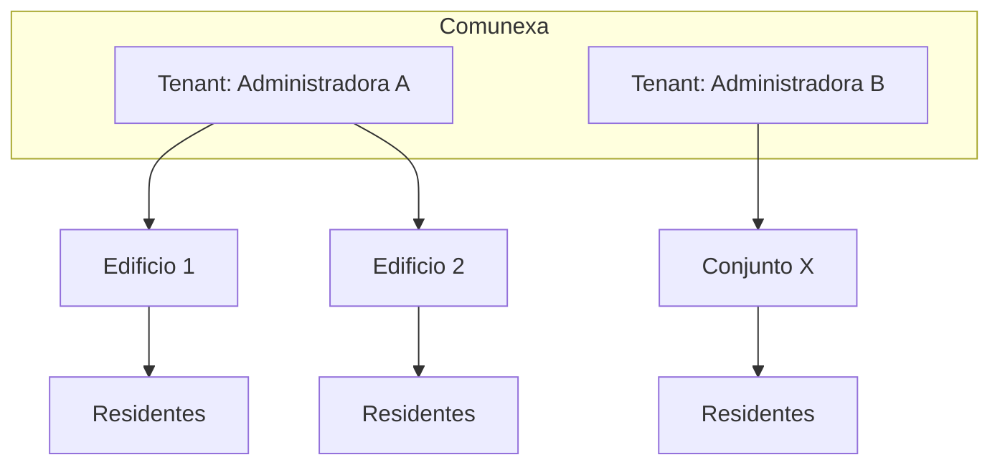

# Visión de producto — Comunexa

## Nombre y significado

**Comunexa** = *comunidad* + *conexión*. Plataforma que conecta administradoras de propiedad horizontal con las comunidades que gestionan: residentes, edificios y operación del día a día.

## Problema

Las administradoras de PH en Colombia y LatAm suelen depender de:

- WhatsApp y llamadas para comunicación
- Excel o procesos manuales para visitas, reservas y cobros
- Apps hechas a medida para una sola empresa, difíciles de mantener y escalar

No existe (o es escaso) un producto **reutilizable** que varias administradoras puedan adoptar con su propia marca y datos separados.

## Propuesta de valor

Una plataforma **SaaS / white-label** donde:

| Para administradoras | Para residentes |
|---|---|
| Un solo lugar para operar varios conjuntos | App clara con la marca de *su* administradora |
| Comunicación, reservas, visitas, PQR, votaciones | Noticias, zonas comunes, mensajes, trámites |
| Menos fricción operativa | Menos dependencia de WhatsApp para lo formal |

## Qué NO es

- No es una red social de vecinos genérica.
- No es la app exclusiva de una sola empresa (aunque un tenant pueda tener app dedicada vía flavors).
- No es un reemplazo del prototipo en producción de Diaz PH hasta completar migración planificada.

## Modelo multi-tenant

Dos niveles de “configurable”:

### 1. Multi-edificio (dentro de un tenant)

Una administradora gestiona **varios conjuntos/edificios**. Cada edificio tiene sus zonas, residentes, noticias y reglas operativas.

### 2. Multi-tenant (varias administradoras)

La plataforma sirve a **distintas empresas administradoras**. Cada una tiene:

- Nombre, slogan, logo, colores, contacto
- Sus edificios, usuarios y documentos
- Datos **inaccesibles** para otros tenants

## Usuarios y roles

| Rol | Descripción |
|---|---|
| **Superadmin plataforma** | Crea tenants, planes, soporte interno (no expuesto a residentes) |
| **Admin de tenant** | Superusuario de la empresa administradora |
| **Admin de edificio** | Gestiona uno o varios conjuntos asignados |
| **Residente / propietario** | Usuario final del edificio |

## Módulos del producto (roadmap funcional)

| Módulo | Descripción |
|---|---|
| Noticias | Feed por edificio |
| Cartelera / dashboard | Anuncios y avisos |
| Zonas comunes | Reservas con calendario |
| Mensajería | Chat administración ↔ residentes |
| Visitas | Registro + PDF |
| Facturación | Cuotas y estados de pago |
| PQR | Peticiones, quejas, reclamos |
| Votaciones | Encuestas y asambleas |
| Notificaciones | Push por edificio (FCM) |

## Branding dinámico

Cada tenant configura (vía Supabase / panel interno):

- Logo y favicon
- Colores primarios/secundarios
- Datos de contacto (dirección, teléfono, email)
- Textos de bienvenida y pie de PDF

La app **no** debe hardcodear “Administradores Diaz PH” en código compartido; Diaz PH será el **primer tenant**, no la identidad del producto.

## Mercado inicial

- **Geografía:** Colombia primero; diseño apto para LatAm (español, normativa PH local).
- **Cliente piloto:** Administradores Diaz PH SAS.
- **Segmento:** empresas que administran propiedad horizontal (no solo un edificio autogestionado).

## Distribución (decisión actual)

**Base por defecto:** una sola app Comunexa en **Google Play**, **App Store** y **web** (Firebase Hosting). Login resuelve el tenant; marca desde tabla `tenants`.

**Pagos in-app:** pausados en v1 (facturación como estado de cuotas; sin pasarela).

**Futuro (si hay demanda enterprise):** flavors white-label por administradora (ícono/nombre propios en tiendas). No es el camino inicial.

## Métricas de éxito (orientativas)

- Tiempo de onboarding de un tenant nuevo (marca + edificio + admin)
- Adopción de residentes por edificio (% registrados)
- Uso de módulos clave (reservas, PQR, noticias) vs. WhatsApp
- Cero incidentes de fuga de datos entre tenants

## Referencia

Casos de uso y pantallas del dominio PH están documentados en el prototipo:

[`../../administradores-diaz-ph-v2/docs/`](../../administradores-diaz-ph-v2/docs/)

Usar como checklist funcional, no como arquitectura a replicar.
