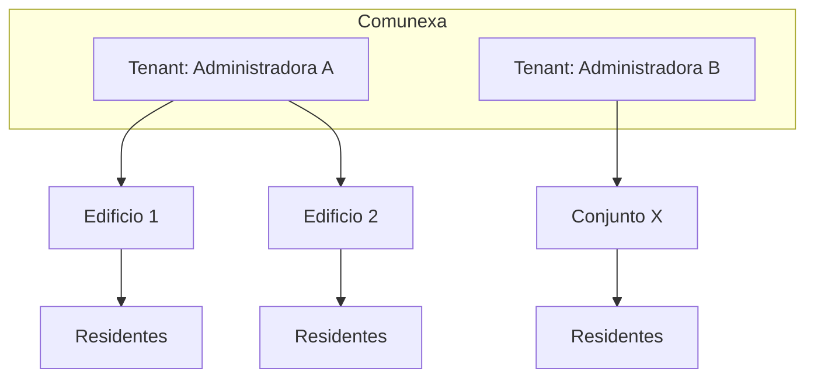

# Visión de producto — Comunexa

## Nombre y significado

**Comunexa** = *comunidad* + *conexión*. Plataforma que conecta administradoras de propiedad horizontal con las comunidades que gestionan: residentes, edificios y operación del día a día.

## Problema

Las administradoras de PH en Colombia y LatAm suelen depender de:

- WhatsApp y llamadas para comunicación
- Excel o procesos manuales para visitas, reservas y cobros
- Apps hechas a medida para una sola empresa, difíciles de mantener y escalar

No existe (o es escaso) un producto **reutilizable** que varias administradoras puedan adoptar con su propia marca y datos separados.

## Propuesta de valor

Una plataforma **SaaS / white-label** donde:

| Para administradoras | Para residentes |
|---|---|
| Un solo lugar para operar varios conjuntos | App clara con la marca de *su* administradora |
| Comunicación, reservas, visitas, PQR, votaciones | Noticias, zonas comunes, mensajes, trámites |
| Menos fricción operativa | Menos dependencia de WhatsApp para lo formal |

## Qué NO es

- No es una red social de vecinos genérica.
- No es la app exclusiva de una sola empresa (aunque un tenant pueda tener app dedicada vía flavors).
- No es un reemplazo del prototipo en producción de Diaz PH hasta completar migración planificada.

## Modelo multi-tenant

Dos niveles de “configurable”:

### 1. Multi-propiedad (dentro de una organización)

Una administradora gestiona **varios edificios o conjuntos**. Cada propiedad tiene unidades, usuarios, zonas, noticias y reglas operativas. Hotel es una extensión futura prevista, no alcance del MVP PH.

### 2. Multi-tenant (varias administradoras)

La plataforma sirve a **distintas empresas administradoras**. Cada una tiene:

- Nombre, slogan, logo, colores, contacto
- Sus edificios, usuarios y documentos
- Datos **inaccesibles** para otros tenants



## Usuarios, roles y alcance

| Rol | Descripción |
|---|---|
| **Superadmin de plataforma** | Administra Comunexa globalmente; no debe confundirse con el responsable de una propiedad |
| **Administrador de organización** | Superusuario de la administradora y de todas sus propiedades |
| **Responsable de propiedad** | Control completo de uno o varios edificios/conjuntos asignados |
| **Operador de propiedad** | Ejecuta tareas delegadas de operación en propiedades asignadas |
| **Miembro / cliente** | Residente, propietario o cliente vinculado a una unidad; huésped en una extensión futura |

Los roles se asignan por membresía. Una misma identidad puede tener diferente rol en cada propiedad.

## Módulos del producto (roadmap funcional)

| Módulo | Descripción |
|---|---|
| Noticias | Feed por edificio |
| Cartelera / dashboard | Anuncios y avisos |
| Zonas comunes | Reservas con calendario |
| Mensajería | Chat administración ↔ residentes |
| Visitas | Registro + PDF |
| Control de acceso | Vigilancia, autorizaciones, entradas/salidas y vehículos |
| Facturación | Cuotas y estados de pago |
| PQR | Peticiones, quejas, reclamos |
| Votaciones | Encuestas y asambleas |
| Notificaciones | Push por edificio (FCM) |

## Branding dinámico

Comunexa permite que cada propiedad tenga identidad propia sin perder la trazabilidad de su administradora ni la marca de la plataforma. El modelo recomendado es:

```text
Logo y nombre de la propiedad
Administrado por <organización>
Tecnología Comunexa
```

Cada organización configura una identidad base y cada propiedad puede heredarla o personalizar:

- Logo y favicon
- Colores primarios/secundarios
- Imagen de portada o bienvenida
- Datos de contacto (dirección, teléfono, email)
- Textos de bienvenida y pie de PDF

Modalidades previstas:

| Modalidad | Identidad mostrada | Etapa |
|---|---|---|
| `inherit` | Organización + Comunexa | MVP |
| `co_branded` | Propiedad + organización + Comunexa | MVP, recomendada |
| `white_label` | Propiedad u organización | Enterprise futuro |

Comunexa mantiene el sistema de diseño: tipografía, estructura, iconografía, componentes y requisitos de accesibilidad. La personalización se limita a activos, colores validados y contenido de marca.

Las imágenes cargadas por clientes se validan, limpian y optimizan en backend. En el MVP se aceptan PNG, JPEG y WebP; SVG de usuarios queda excluido.

La app **no** debe hardcodear “Administradores Diaz PH” en código compartido; Diaz PH será el **primer tenant**, no la identidad del producto.

## Mercado inicial

- **Geografía:** Colombia primero; diseño apto para LatAm (español, normativa PH local).
- **Cliente piloto:** Administradores Diaz PH SAS.
- **Segmento:** empresas que administran propiedad horizontal (no solo un edificio autogestionado).

## Distribución (decisión actual)

**Base por defecto:** una sola app Comunexa en **Google Play**, **App Store** y **web** (Firebase Hosting). Login resuelve el tenant; marca desde tabla `tenants`.

**Pagos in-app:** pausados en v1 (facturación como estado de cuotas; sin pasarela).

## Modelo comercial y acceso

La organización administradora o el conjunto/propiedad contrata Comunexa mediante suscripción B2B; los usuarios finales no pagan por crear su cuenta ni acceder. Una administradora puede consolidar varias propiedades en una factura o cada propiedad puede pagar directamente. El precio objetivo combina cargo base, unidades activas y complementos. Planes conceptuales: `essential`, `management` y `enterprise`; precios y límites se validan en el piloto.

El alta de miembros combina invitaciones privadas —que pueden preaprobar persona y unidad— con solicitudes mediante un código público de propiedad. El código público nunca concede acceso: `organization_admin`, `property_manager` o un `property_staff` autorizado debe aprobar la solicitud.

Detalle y estados: [`subscriptions-and-onboarding.md`](subscriptions-and-onboarding.md).

Una identidad puede pertenecer a varias propiedades con funciones diferentes. Si tiene un solo contexto entra directamente; si tiene varios, elige “¿A dónde quieres entrar?” y puede cambiar desde el menú sin cerrar sesión.

**Futuro (si hay demanda enterprise):** modo sin firma Comunexa y flavors white-label por organización (ícono/nombre propios en tiendas). No es el camino inicial.

En la app nativa compartida, el icono y nombre instalados siguen siendo Comunexa; el branding particular aparece dentro de la experiencia. Una PWA dedicada puede instalarse con nombre/icono del cliente mediante su propio manifest. Una app nativa con nombre/icono del conjunto, empresa u hotel requiere un build y publicación white-label enterprise independientes.

## Métricas de éxito (orientativas)

- Tiempo de onboarding de un tenant nuevo (marca + edificio + admin)
- Adopción de residentes por edificio (% registrados)
- Uso de módulos clave (reservas, PQR, noticias) vs. WhatsApp
- Cero incidentes de fuga de datos entre tenants

## Referencia

Casos de uso y pantallas del dominio PH están documentados en el prototipo:

[`../../administradores-diaz-ph-v2/docs/`](../../administradores-diaz-ph-v2/docs/)

Usar como checklist funcional, no como arquitectura a replicar.
