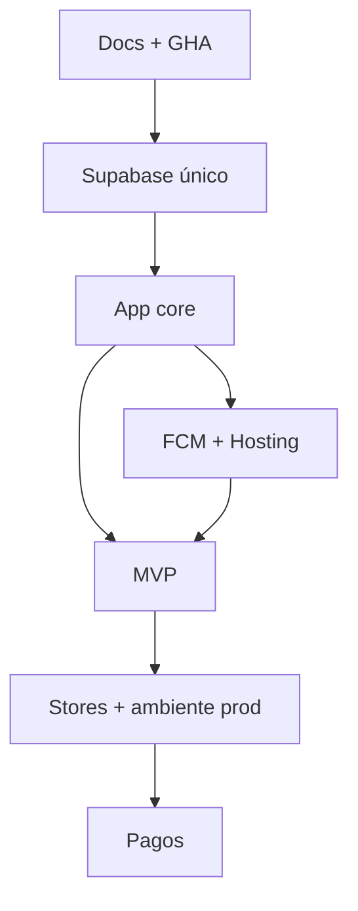

# Roadmap — Comunexa

Estado al **2026-08-25**.

## Fase 0 — Fundamentos

- [x] Docs + brief (incl. CI/CD GHA, Hosting, pagos pausados)
- [x] Schema SQL + RLS (`supabase/migrations/`)
- [x] Bootstrap Flutter + `Env` (`.env` / dart-define)
- [x] Tema Comunexa light/dark + assets de marca
- [x] Workflows `web.yml` / `android.yml` / `ios.yml`
- [x] Stub `payment-webhook`
- [x] Remote git (`origin` → GitHub)
- [ ] Secrets / variables GHA configurados en el repo
- [ ] CI verde en `main` (analyze + test + deploy Hosting)

## Fase 1 — Supabase dev

- [x] Migrar modelo de acceso mínimo (003): organizations / properties / memberships / occupancies / permisos+presets
- [x] RLS + tests pgTAP acceso objetivo (aislamiento org, manager asignado, residente, multirrol, sin membresías)
- [ ] Cutover datos legacy (`tenants`/`buildings` → org/property) + reescribir RLS de dominio
- [ ] Separar uso de `property_manager` vs `property_staff` en app; `platform_superadmin` vía flag
- [ ] Proyecto + `db push`
- [ ] Auth OAuth Google/Apple + Storage buckets
- [ ] Branding jerárquico: organización + propiedad, fallback y permisos de Storage
- [ ] Pipeline de media: PNG/JPEG/WebP, validación, re-encode, metadatos y variantes; sin SVG de usuario
- [ ] Modelo SQL de `billing_accounts` + suscripción/entitlements; pagador organización o propiedad, activación manual
- [ ] Invitaciones privadas + código público + solicitudes aprobables + auditoría
- [ ] Seed Diaz PH
- [ ] Tests RLS de dominio (news/visits/…) + cutover

## Fase 2 — App core

- [x] UI Login responsive (móvil / tablet / desktop, light+dark)
- [x] Splash → Login (Navigator) — móvil · tablet port `#118:117`/`#118:128` · tablet land `#118:95`/`#118:106` · desktop `#118:73`/`#118:84`
- [x] Auth email/password real (Supabase Auth) + restore sesión + signOut + reset password; demos Figma `demo:invalid|empty|locked|offline`
- [x] Smoke tests widget del login (breakpoints + demos OAuth coming soon)
- [x] Botón Apple Sign-In solo en iOS/macOS (Google en todas; OAuth cableado pendiente)
- [x] Home shell mock:
  - móvil: header + bottom nav + feed Noticias
  - tablet portrait (≥700, portrait): feed + eventos horizontales light/dark (`#74:5` / `#74:117`)
  - tablet landscape (≥900, landscape): dashboard compacto light/dark (`#35:487` / `#35:606`)
  - desktop (≥1280): dashboard sidebar light/dark (`#35:233` / `#35:353`)
- [x] Smoke tests home (móvil / tablet portrait / tablet landscape / desktop · light+dark)
- [x] SessionProvider con Auth + persistencia local de contexto (`shared_preferences`)
- [x] Añadir noticia todos breakpoints light+dark (móvil / tablet port `#116:5`/`#116:92` / tablet land / desktop) + FAB/CTA
- [x] `supabase_flutter` bootstrap tipado (`ComunexaSupabase`)
- [x] go_router: `/login` · `/select-context` · `/home` · `/news/new` + redirects por sesión/contexto
- [ ] OAuth Google/Apple + repositorios de dominio
- [ ] Onboarding híbrido: aceptar invitación o solicitar ingreso a propiedad
- [x] Selector de contexto multirrol mobile light/dark (`#99:5` / `#99:67`)
- [x] Selector de contexto tablet portrait light/dark (`#100:475` / `#100:547`)
- [x] Selector de contexto tablet landscape light/dark (`#100:331` / `#100:402`)
- [x] Selector de contexto desktop light/dark (`#99:185` / `#99:256`)
- [ ] Contexto de plataforma separado y auditoría de acceso de soporte
- [ ] Home por rol + branding efectivo (`co_branded` por defecto)

## Fase 3 — FCM + Hosting

- [ ] Un proyecto Firebase (FCM + Hosting)
- [ ] Deploy web (manual o CI desde `main`)
- [ ] `send-push` MVP

## Fase 4 — MVP funcional

1. Noticias (UI mock + formulario añadir todos breakpoints salvo tablet port dark; backend pendiente)
2. Reservas  
3. Visitas + PDF  
   - Control de acceso: preset `security_guard`, autorizaciones, vehículos y eventos auditables
4. PQR  
5. Mensajería  
6. Facturación **solo lectura/estado** (sin pasarela)  
7. Votaciones  
8. Push en eventos  

## Fase 5 — Tiendas + segundo ambiente

- [ ] Fastlane + tags → TestFlight / Play internal (`ENABLE_*_CI`)
- [ ] Tenant #2 demo
- [ ] **Separar `prod`** (Supabase + Firebase) cuando haya datos/usuarios reales

## Fase 6 — Pagos (cuando el producto lo pida)

- [ ] Wompi o PayU
- [ ] Implementar `payment-webhook`
- [ ] Checkout en app

## Dependencias

## Fuera de scope v1

- Staging / multi-ambiente
- Cobro in-app
- `white_label` sin firma Comunexa y flavors por organización
- PWA/manifests por cliente y builds nativos con nombre/icono propios (enterprise)
- Migración automática desde prototipo en producción
- Flujos hoteleros (reservas de habitación, check-in/out y tarifas); solo se preserva extensibilidad del modelo
