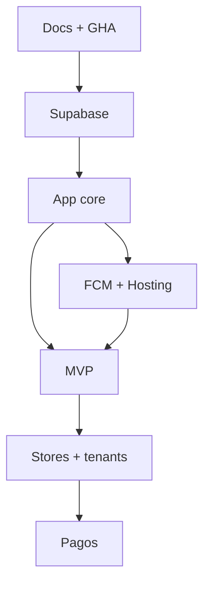

# Roadmap — Comunexa

## Fase 0 — Fundamentos

- [x] Docs + brief (incl. CI/CD GHA, Hosting, pagos pausados)
- [x] Schema SQL + RLS
- [x] Bootstrap Flutter
- [x] Workflows `web.yml` / `android.yml` / `ios.yml`
- [x] Stub `payment-webhook`
- [ ] Remote git + secrets GHA mínimos
- [ ] CI verde en `main` (analyze + test)

## Fase 1 — Supabase dev

- [ ] Proyecto + `db push`
- [ ] Auth + Storage buckets
- [ ] Seed Diaz PH
- [ ] Tests RLS

## Fase 2 — App core

- [ ] `supabase_flutter` + go_router + SessionProvider
- [ ] Login + home por rol + tema tenant

## Fase 3 — FCM + Hosting

- [ ] Firebase FCM + Hosting por entorno
- [ ] Deploy web automático desde `main`
- [ ] `send-push` MVP

## Fase 4 — MVP funcional

1. Noticias  
2. Reservas  
3. Visitas + PDF  
4. PQR  
5. Mensajería  
6. Facturación **solo lectura/estado** (sin pasarela)  
7. Votaciones  
8. Push en eventos  

## Fase 5 — Tiendas + multi-tenant

- [ ] Fastlane match + supply/pilot
- [ ] Tags → TestFlight / Play internal
- [ ] Tenant #2 demo
- [ ] Staging/prod

## Fase 6 — Pagos (cuando el producto lo pida)

- [ ] Wompi o PayU
- [ ] Implementar `payment-webhook` (quitar stub)
- [ ] Checkout en app + comprobantes

## Dependencias

## Fuera de scope v1

- Cobro in-app / pasarela
- Flavors white-label por cliente
- Migración automática desde prototipo en producción
