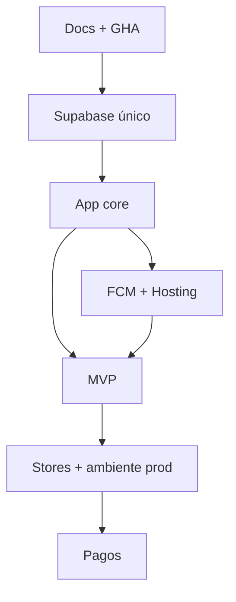

# Roadmap — Comunexa

Estado al **2026-08-25** (rama `main` @ `d460f7a`).

## Fase 0 — Fundamentos

- [x] Docs + brief (incl. CI/CD GHA, Hosting, pagos pausados)
- [x] Schema SQL + RLS (`supabase/migrations/`)
- [x] Bootstrap Flutter + `Env` (`.env` / dart-define)
- [x] Tema Comunexa light/dark + assets de marca
- [x] Workflows `web.yml` / `android.yml` / `ios.yml`
- [x] Stub `payment-webhook`
- [x] Remote git (`origin` → GitHub)
- [ ] Secrets / variables GHA configurados en el repo
- [ ] CI verde en `main` (analyze + test + deploy Hosting)

## Fase 1 — Supabase dev

- [ ] Proyecto + `db push`
- [ ] Auth + Storage buckets
- [ ] Seed Diaz PH
- [ ] Tests RLS

## Fase 2 — App core

- [x] UI Login responsive (móvil / tablet / desktop, light+dark) — **solo presentación**
- [x] Splash → Login (Navigator; sin sesión real)
- [x] Smoke tests widget del login
- [x] Botón Apple Sign-In solo en iOS/macOS (Google en todas)
- [ ] `supabase_flutter` + go_router + SessionProvider
- [ ] Auth real (email/password; OAuth Google/Apple = stubs UI)
- [ ] Home por rol + tema tenant dinámico

## Fase 3 — FCM + Hosting

- [ ] Un proyecto Firebase (FCM + Hosting)
- [ ] Deploy web (manual o CI desde `main`)
- [ ] `send-push` MVP

## Fase 4 — MVP funcional

1. Noticias  
2. Reservas  
3. Visitas + PDF  
4. PQR  
5. Mensajería  
6. Facturación **solo lectura/estado** (sin pasarela)  
7. Votaciones  
8. Push en eventos  

## Fase 5 — Tiendas + segundo ambiente

- [ ] Fastlane + tags → TestFlight / Play internal (`ENABLE_*_CI`)
- [ ] Tenant #2 demo
- [ ] **Separar `prod`** (Supabase + Firebase) cuando haya datos/usuarios reales

## Fase 6 — Pagos (cuando el producto lo pida)

- [ ] Wompi o PayU
- [ ] Implementar `payment-webhook`
- [ ] Checkout en app

## Dependencias

## Fuera de scope v1

- Staging / multi-ambiente
- Cobro in-app
- Flavors white-label
- Migración automática desde prototipo en producción
